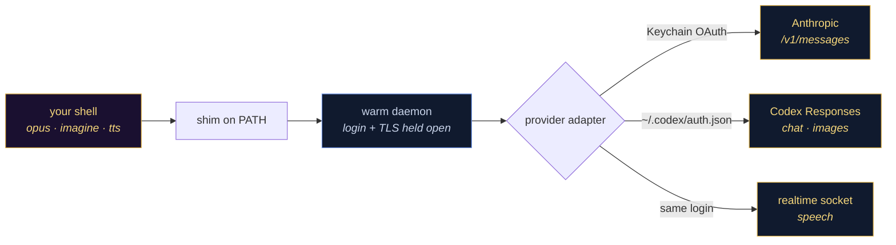

<div align="center">
  
</div>

<div align="center">

[](https://github.com/fire17/apiplan/actions/workflows/ci.yml)
[](https://github.com/fire17/apiplan/releases)
[](test/)
[](package.json)
[](#cross-platform)
[](LICENSE)
[](https://github.com/fire17/apiplan/stargazers)

*You already pay for the frontier. This puts it in your shell.*

**[⚡ Install](#install--one-line)** · **[🧠 Models](#a-family-name-always-means-the-newest-model)** · **[🎨 Images & speech](#pictures-and-speech)** · **[🛠 Your own commands](#make-your-own-commands)** · **[📐 How it works](#how-it-works)**

</div>

---

## The part that should stop you

**The core chat, image, and speech paths below run on subscriptions you already have.**
APIPlan only reads an API key when you explicitly select a public-provider feature:
Gemini `--public` vision, Veo video, or Lyria music. Those calls may be billed by Google.

- **Text** — `opus`, `sonnet`, `haiku`, `fable`, `sol`, `luna`, `terra`. The alias is
  checked against the API's own served-model field, so `opus → claude-opus-5` is
  observed, not assumed.
- **Images** — `imagine a lighthouse at dusk` draws on the same Codex endpoint as chat,
  via the built-in `image_generation` tool. No key, no separate service.
- **Speech** — `tts <anything>` speaks in ten voices over OpenAI's realtime socket
  (`gpt-realtime`), which accepts the ChatGPT login and returns PCM16 that needs a
  44-byte wav header and **no codec**. Any language; Hebrew verified.
- **Zero dependencies.** 7,202 lines across the text/model CLI and provider core,
  `dependencies: {}`, `devDependencies: {}`. Speech needed no WebRTC stack in the end —
  just a WebSocket without a retired header.
- **Every claim is receipted.** `DARWIN.md` logs the measure-fix-verify trail including
  failed routes, a budget that measured the operating system, and the cache cutover below.

> [!IMPORTANT]
> If you pay for Claude Code or ChatGPT, you already own everything this ships. It just
> makes it typeable.



---

## See it

```console
$ opus explain monads in one sentence
A monad is a way to chain operations that carry context — like error state or I/O —
without writing the plumbing at every step.

$ cat server.log | sonnet find the root cause | pbcopy
$ sol -i screenshot.png what is wrong with this layout
$ haiku-fast is 91 prime
No — 91 = 7 × 13.

$ imagine a lighthouse keeper reading a letter by lamplight
image saved: apiplan-20260802-1834.png (2936KB)

$ tts the lighthouse keeper found a letter in the sand
audio saved: apiplan-20260802-1835.wav (157KB, voice alloy via realtime)
```

Every model becomes its own command. Pipes work in both directions. Images work. A
background daemon keeps your login and connection warm, so a repeat call answers in
under a second.

---

## Install — one line

```sh
curl -fsSL https://raw.githubusercontent.com/fire17/apiplan/main/install.sh | sh
```

```powershell
irm https://raw.githubusercontent.com/fire17/apiplan/main/install.ps1 | iex   # Windows
```

That's the whole setup on a new machine: it fetches itself to `~/.apiplan/src`, installs
[bun](https://bun.sh) if you don't have it (one binary, no admin), and puts every model
command on your PATH. Re-run it any time to update, or use `apiplan update`.

Working from a clone instead? `git clone … && cd apiplan && sh install.sh` — it detects the
checkout and wires the commands to it, and tells you which tree it used.

You must already be logged into `claude` and/or `codex`. **apiplan never asks for a
credential, never stores one, and never sends one anywhere except the provider it came
from.**

The global `gemini` command can also use an existing Gemini API key from
`APIPLAN_GEMINI_API_KEY`, `GEMINI_API_KEY`, or `~/.config/gemini/api_key`. That key is
only sent to Google's Gemini API and is required for `--public`, `--video`, and `--song`.

Then `apiplan` shows you everything:

```console
$ apiplan status
apiplan v0.7.0  ·  macOS  ·  daemon warm

PROVIDERS
  ● anthropic    Claude Code subscription · 10 models
  ● openai       Codex / ChatGPT subscription · 8 models
  ● google       Antigravity / Gemini Code Assist subscription · 4 models
  ● ollama       local · 9 models

COMMANDS 37 configured in ~/.bun/bin
  opus  opus-fast  sonnet  sonnet-fast  sol  gemini  heretic  imagine  tts  …
```

## A family name always means the newest model

`opus` is whichever Opus is current — today `claude-opus-5`. When Opus 6 ships, `opus`
follows it, because the list comes from the provider's own model endpoint rather than a
table someone has to remember to edit. Explicit versions never stop working:

| you type | you get |
|---|---|
| `opus` | newest Opus (`claude-opus-5`) |
| `opus5` · `opus48` · `opus47` · `opus45` | that exact version |
| `opus4.8` · `Opus-4-8` · `OPUS_4_8` | same thing — separators and case are folded |
| `sonnet` · `haiku` · `fable` | newest of each family |
| `sol` · `luna` · `terra` | the current GPT-5.6 variants |
| `gpt55` · `gpt54mini` | that exact OpenAI model |
| `claude-opus-4-8` | a full id passes straight through |

```console
$ apiplan models
ANTHROPIC connected · just now
  MODEL                       ALIASES         EFFORT
  claude-opus-5               opus opus5      low/medium/high/xhigh/max
  claude-opus-4-8             opus48          low/medium/high/xhigh/max
  …
```

Every alias is verified against the API's own report of which model answered — run any
command with `-v` and it tells you: `served by claude-opus-5 · first token 958ms`.

## Usage

```sh
opus <your question>                 # no quotes needed
opus -e xhigh design a rate limiter  # reasoning effort: low → max
opus -i chart.png -i notes.jpg compare these
opus -i clipboard whats wrong here   # paste a screenshot straight in
cat file | opus summarise            # stdin is appended to your prompt
opus --loop 3 write a haiku          # self-refine before answering
opus -s be extremely terse hello     # system prompt
echo '[{"role":"user","content":"hi"}]' | opus --chat    # multi-turn
opus --dry-run hello                 # show the exact request, send nothing
opus --help                          # every flag, one screen
```

Gemini adds low/medium/high reasoning, broad file understanding, and separate media
generators:

```sh
gemini -e low -i frame.png 'what changed?'              # AGY vision route
gemini --public -e low -i frame.png 'what changed?'     # public API-key route
gemini -f clip.mp4 'describe the actions in order'      # audio/video/PDF/text also work
gemini --draw -o image.jpg 'a blue glass bird'          # AGY image generator
gemini --video --duration 4 -o clip.mp4 'a paper boat'   # Veo; Gemini API key
gemini --song -o song.mp3 'warm synth-pop instrumental' # Lyria; Gemini API key
gemini --speak -o voice.wav 'hello from Gemini'          # Gemini TTS; API key
apiplan media                                           # live-discovered media models
apiplan vision clip.mp4 --fps 2 --concurrency 8          # ordered frame understanding
```

`--file` is repeatable and accepts images, audio, video, PDFs, JSON, notebooks, rich
text, and source/text files. AGY currently advertises image generation only; APIPlan
does not pretend that AGY OAuth unlocks Veo or Lyria. Video and music use the public
Gemini endpoints and the key above.

`apiplan vision` samples a video with ffmpeg, analyzes frames through bounded concurrent
public-Gemini calls, and prints ordered JSONL for a monitoring/aggregation agent. Each
record carries `seq` and `timestampMs`; failures are emitted in place instead of being
silently dropped. The final stderr receipt proves `sampled = completed = emitted`. Its
reported FPS is pipeline throughput, not a claim that any individual action arrived in
under a second.

`*-fast` twins (`opus-fast`, `sol-fast`, …) bake in the least reasoning the provider
allows plus streaming, for the quickest possible first token.

### Just type the command to chat

Run any of them with no prompt and you get a conversation instead of an error:

```console
$ opus
Claude Opus 5  (claude-opus-5) · /help for commands, /exit to leave

› my name is Tami, remember it
Got it — your name is Tami.

› what is my name?
Your name is Tami.
```

```
/clear      forget the conversation so far
/system …   set a system prompt for the rest of the session
/retry      ask again, same prompt
/copy       copy the last reply to the clipboard
/exit       leave  (Ctrl-D, or Ctrl-C twice)
```

Ctrl-C stops a reply mid-stream without leaving the session. It streams **inline**
rather than taking over the screen, so scrollback, selection and copy-paste all keep
working — and it is built on `node:readline`, so history and line editing come from the
standard library and the zero-dependency promise survives. Piped or scripted use is
unchanged: no TTY still means the old help-and-exit.

### Pictures and speech

```sh
imagine a lighthouse at dusk, watercolour      # draws it, then opens it
imagine --size 1024x1536 --quality high -o cover.png a paperback cover
imagine --raw a single red triangle on white   # your words, character for character

tts a short fresh sentence                     # any text, spoken on the subscription
tts --as "excited, laughing" you actually did it
tts --as "whispering" --voice cedar a secret
tts --aloud --voice cove                       # re-read your newest ChatGPT reply
apiplan voices                                 # every voice, and where it comes from
```

By default the model rewrites your prompt before drawing — `a single red triangle on
white` becomes *"A minimalist image with a single solid red equilateral triangle centred
on a pure white background…"* — which is why the run prints `prompt used:`. That helps a
terse prompt and ruins a precise one, so `--raw` turns it off and `--enhance` asks for it
explicitly. To make either one your default, bake it into the command:
`apiplan rm imagine && apiplan add imagine --model sol --flags "--draw --raw --open"`.

`imagine` runs on the same Codex endpoint as everything else — no API key. So does
`aloud`: it is ChatGPT's own **read-aloud**, in the real product voices
(`maple juniper orbit fathom breeze ember glimmer vale cove`), and it reads any
language the message is written in — Hebrew, Arabic, Japanese — with no setup.

Every `imagine` call is fresh: only the prompt you typed, `store: false`, a new session
id, nothing retained. `aloud` is the one command that reads stored history — that is
what read-aloud *is*: `GET /backend-api/synthesize` takes a `conversation_id` and a
`message_id` and no text parameter at all.

`tts` speaks your own words — also on the subscription, also with no API key. It goes
over OpenAI's **realtime** socket (`gpt-realtime`), which accepts the ChatGPT login and
streams back PCM16 that needs a 44-byte wav header and no codec at all. Ten voices:
`alloy ash ballad coral echo sage shimmer verse marin cedar`.

### Direct the performance, not just the words

`gpt-realtime` is a conversational speech model, so **how** a line is said is a second
input. `--as` takes free text — an emotion, a pace, a character, a stage direction:

```sh
tts --as "excited, laughing out loud" I cannot believe you actually pulled that off
tts --as "furious, shouting" the server has been down for three days
tts --as "very slowly, heartbroken, tearful" I did not think it would end this way
tts --as "a grizzled pirate captain, gravelly and theatrical" --voice ash land ho
tts --as-file director-notes.md the long monologue
```

`--style`, `--emotion` and `--direction` are synonyms. It really performs — measured on
one identical line, direction only:

| `--as` | seconds | loudness (RMS) |
|---|---|---|
| *(none — baseline)* | 3.70 | 0.0997 |
| `excited, laughing out loud` | 4.65 | 0.1364 |
| `whispering, conspiratorial` | 3.75 | **0.0572** |
| `furious, shouting` | 3.85 | 0.1354 |
| `very slowly, heartbroken, tearful` | **9.15** | **0.0509** |

A whisper is 2.7× quieter than a laugh and a heartbroken read runs 2.5× longer than the
baseline — same words each time. Asked to laugh, it laughs: three of three runs put a
real `[laughs]` in the model's own transcript. Directions work in any language.

Without `--as`, the read stays strictly verbatim — the direction is opt-in, and a test
holds it from leaking into the spoken words.

`--aloud` is a second, older engine: ChatGPT's product read-aloud, in the app's own
voices (`maple juniper orbit fathom breeze ember glimmer vale cove`). It can only speak
a message that already exists in your history, so it is a flag rather than a command.
Prefer `tts`; reach for `--aloud` when you specifically want one of those voices.

```sh
tts a lighthouse keeper found a letter in the sand
tts --voice cedar שלום, זה מבחן קצר בעברית      # any language, same command
tts --local a short offline test                # force the OS voice instead
tts --aloud --conversation <id> --message <id>  # read one specific message
```

If the realtime socket is ever unavailable, `tts` falls back to your OS voice and says
it did — picking a voice that matches the text's script, because an English voice
reading Hebrew is noise rather than speech.

### Quotes, `?` and `*`

Your shell — not this tool — is what eats `?` in `opus is this right?`. zsh needs one
line to stop:

```sh
eval "$(apiplan shell-init)"     # add to ~/.zshrc
```

bash, cmd.exe and PowerShell already pass them through, and `apiplan shell-init` tells
you so instead of adding aliases you don't need.

## jimmy — a model that runs in silicon

`chatjimmy.ai` is [Taalas](https://taalas.com)' demo of a model cast into hardware rather
than run on a GPU. It is startlingly fast, it needs no account, and `jimmy` puts it in
your shell:

```sh
jimmy is 91 prime
cat error.log | jimmy what is failing here
jimmy --stats how many moons does saturn have
```

```console
$ jimmy --stats what is 17 times 23
17 × 23 = 391
17697 tok/s decode · 15914 tok/s prefill · server TTFT 1.13ms · 26 tokens
```

At 1 ms to first token the model is never the slow part — **the TLS handshake is**. So
`jimmy` keeps a warm connection the same way the rest of apiplan does, which is the whole
difference between the two numbers below:

| | first byte |
|---|---|
| cold (new TLS handshake) | ~490 ms |
| warm (connection held open) | **~180 ms** |

The remaining ~170 ms is the round trip to their server; their own telemetry reports 15 ms
of it. That part is physics, not code.

`--stats` prints their speed numbers to stderr so stdout stays pipeable. No key, no
account. `JIMMY_API` / `JIMMY_MODEL` point it elsewhere; `JIMMY_DAEMON=off` disables the
warm holder.

## Point any SDK at localhost — with caching intact

`apiplan serve` runs a local server that speaks **OpenAI's and Anthropic's wire shapes
exactly**. Swap the base URL and existing code answers from your subscription — no key,
no per-token bill, nothing else changed.

```sh
apiplan serve                    # http://127.0.0.1:8787
```

```python
from openai import OpenAI
client = OpenAI(api_key="not-needed", base_url="http://127.0.0.1:8787/v1")
client.chat.completions.create(model="opus", messages=[...])
```

```sh
export OPENAI_BASE_URL=http://127.0.0.1:8787/v1
export ANTHROPIC_BASE_URL=http://127.0.0.1:8787
```

**The dialect and backend are independent.** The path decides response shape; `model`
decides who answers. The server preserves native Anthropic `cache_control` blocks and
OpenAI `prompt_cache_key`, reports cache-read/write usage in both dialects, and keeps the
cached route as the only production policy. There is no legacy non-cached mode to drift
back into.

`apiplan hotswap upgrade` drains the server already owning port 8787, hands the listener
to the current build, and keeps clients on the same URL. The cache rollout used that exact
path: 40/40 parallel continuity probes returned 200 after the swap; repeat live calls
reported **16,226 Anthropic cache-read tokens** and **4,864 OpenAI cached tokens**.

| endpoint | shape |
|---|---|
| `POST /v1/chat/completions` | OpenAI chat, streaming and not |
| `POST /v1/messages` | Anthropic messages, streaming and not |
| `POST /v1/audio/speech` | OpenAI speech — `instructions` steers delivery, like `--as` |
| `POST /v1/images/generations` | OpenAI images, `b64_json` |
| `GET /v1/models` | 32 live models across Anthropic, OpenAI, Google, Ollama and jimmy |

Verified live across all four provider families: `opus → claude-opus-5`,
`sol → gpt-5.6-sol`, `gemini → gemini-3.7-flash`, and `heretic → heretic:latest`.
Official OpenAI and Anthropic SDK contracts remain covered in the test suite.

It binds `127.0.0.1` only, because it hands out your subscription to anything that can
reach it. Set `APIPLAN_API_KEY` to require a key (enforced on `Authorization` *and*
`x-api-key`), `--port` / `--host` to move it.

## Make your own commands

Commands are data, not code. `~/.apiplan/commands.json` is the source of truth and the
shims on your `PATH` are generated from it.

```sh
apiplan add ask --model sonnet --flags "-e low --stream"   # a new command
apiplan rename ask q                                       # call it whatever you like
apiplan rm q
apiplan commands                                           # what exists, and is it on PATH
apiplan sync                                               # rebuild every shim from config
apiplan prune                                              # drop shims an old version left
apiplan update                                             # pull the latest + re-sync
apiplan path --raw                                         # just the bin dir, for scripts
```

Or run `apiplan` with no arguments for a dashboard: `↑↓` to select, `1`/`2`/`3` to move
between providers, models and commands, `n` new, `r` rename, `f` flags, `d` delete,
`R` refresh, `i` install the default set.

apiplan refuses to install a command whose name a real system tool already owns — on
macOS `gpt` is `/usr/sbin/gpt`, the partition-table editor — and tells you how to pick
another name or take it anyway.

## Speed

Measured on this machine (bun 1.3.14, darwin arm64); reproduce with `bun bench/perf.ts`.

| | |
|---|---|
| client overhead, no network | **24 ms** against a ≤25 ms budget |
| overhead we add to a warm call | **3 ms** — dispatch + drain inside the client |
| warm call vs raw fetch | **748 ms vs 769 ms** in the release run *(observational; provider jitter is not gated)* |
| credential read the daemon skips | **17 ms** *(observational OS cost)* |
| idle daemon | **55 MB**, under the 80 MB budget; ~0 % CPU, exits after 30 min |

The daemon starts on your first call, caches the credential and holds provider connections
open. It never delays a cold call: if it is not up yet, that call goes direct while the
daemon warms for the next one. `--no-daemon` opts out; `APIPLAN_DAEMON=off` disables it.

What it can't fix: network round-trip and the provider's own first-token time. Those are
most of the ~1 s, and no client can remove them.

## How it works

```
opus / sonnet / sol / …        thin shims, generated from commands.json
        └── bin/ask.ts         one CLI for every model
                ├── src/registry.ts    aliases → model ids, from each provider's own list
                ├── src/providers.ts   per-vendor: credential, endpoint, request, stream
                ├── src/engine.ts      argv · images · SSE · the warm daemon
                └── src/platform.ts    macOS · Linux · WSL · Windows differences
bin/apiplan.ts                 status · models · commands · doctor · TUI
```

Anthropic calls go to `/v1/messages`; OpenAI uses Codex Responses; Google uses the
Antigravity Code Assist subscription; Ollama stays on loopback. The API surface preserves
cache identities and usage receipts rather than flattening them away. Fragile endpoints
remain environment-overridable (`apiplan --help`) so a server-side move is configuration,
not a rebuild.

## Cross-platform

| | credentials | commands | daemon IPC |
|---|---|---|---|
| macOS | Keychain, then `~/.claude/.credentials.json` | `sh` shim | unix socket, mode 0600 |
| Linux · WSL | `~/.claude/.credentials.json` | `sh` shim | unix socket, mode 0600 |
| Windows | `%USERPROFILE%\.claude\.credentials.json` | `.cmd` + `.ps1` | loopback TCP + per-run token |

Codex reads `~/.codex/auth.json` everywhere. The Windows transport is exercised on every
platform via `APIPLAN_IPC=tcp`, and an unauthenticated request to that port gets a 403.

**Honest status per platform:**

All four are verified by **actually running there**, not by unit tests alone:

| | verified how |
|---|---|
| **macOS** | ✅ developed here — both providers live, images, 25-way parallel calls |
| **Linux** | ✅ the *published* repo in a container: 88 tests, platform detection, unix-socket IPC, credential fallback to `~/.claude/.credentials.json`, and the one-line install on a bare box with only git+curl |
| **WSL** | ✅ a real WSL2 machine (`5.15-microsoft-standard-WSL2`) with no bun/claude/codex installed: one-line install fetched bun, `osLabel: WSL`, 87 tests, aliases, bare sentence through the shim |
| **Windows** | ✅ every push, on `windows-latest`: 88 tests, alias resolution, the commands installed and invoked **through the generated `.cmd`** with an unquoted sentence, the `.ps1` twin from PowerShell, and the loopback-TCP daemon coming up |

CI runs the matrix on every push — [see the runs](https://github.com/fire17/apiplan/actions/workflows/ci.yml).

On Windows each command installs three files: `.cmd` (cmd.exe/PowerShell via `PATHEXT`),
`.ps1` (pwsh quoting and piping) and an extensionless sh shim (Git Bash/MSYS, which appends
only `.exe` and would otherwise find nothing). PowerShell still resolves the `.cmd` — checked
in CI, not assumed.

## Troubleshooting

```sh
apiplan doctor      # PATH, logins, daemon, shadowed names — with the fix for each
```

| symptom | cause | fix |
|---|---|---|
| `auth rejected (401/403)` | login expired | run `claude` / `codex` once |
| `no matches found: right?` | your shell ate the `?` | `eval "$(apiplan shell-init)"` |
| `command not found: opus` | bin dir not on PATH | `apiplan path` prints the line to add |
| `skipped gpt — would shadow …` | a real tool owns that name | `apiplan rename gpt g5`, or `apiplan sync --force` |
| `image is 1×1px — too small` | model needs ≥ 8×8 | send a real image |
| answers ignore an `APIPLAN_*` override | — | overrides bypass the daemon automatically; nothing to do |

## Development

```sh
bun test                  # 271 tests: cache, aliases, wire contracts, media, health, rotation, truncation
bun bench/perf.ts         # all 7 performance budgets + observational network rows
```

`VISION.md` is the founding brief, `BUDGETS.md` turns its adjectives into enforced
numbers, `LADDER.md` is the information architecture, and `DARWIN.md` records the
measure-fix-verify trail — including failures and rejected optimizations, not only wins.

## What it touches, and how to undo it

| | |
|---|---|
| **Reads** | existing Claude Code, Codex and Antigravity logins; Ollama on loopback |
| **Writes** | `~/.apiplan/` (commands, model catalogs, health/cache state) and generated shims in your bin dir |
| **Never touches** | credential contents or Codex history (`store: false`); it refuses to shadow a real system tool |
| **Uninstall** | `apiplan prune && rm -rf ~/.apiplan` — generated shims are plain files |
| **Escape hatch** | `APIPLAN_DAEMON=off`, `--no-daemon`, editable `~/.apiplan/commands.json` |

## How the claims are enforced

Every push runs the suite on **ubuntu, macos and windows** ([CI](https://github.com/fire17/apiplan/actions/workflows/ci.yml)).
The tests are wire-contract tests: they assert the exact request shape, so a silently
degraded call (`-e high` becoming a 400 on Opus 4.8 — a real bug this caught) fails the
build rather than your terminal. `bun bench/perf.ts` holds the numbers in `BUDGETS.md`,
and reports the ones it can only observe — like the credential read — as observational
rather than pretending to own them.

## Notes

Your subscription's terms and rate limits apply exactly as they do in the official
clients; this only changes the shape of the call, not the agreement. OpenAI calls set
`store: false`, so they stay out of your Codex history.

<div align="center">

### ⭐ If your shell got better today

apiplan exists because a login you already have can do more than the app it came with.
If that turned out to be true for you, a star is how the next person finds out.

[](https://star-history.com/#fire17/apiplan&Date)

MIT · built with [Claude Code](https://claude.com/claude-code)

<sub><i>Measured, not assumed — see DARWIN.md for the rounds that failed first.</i></sub>

</div>
