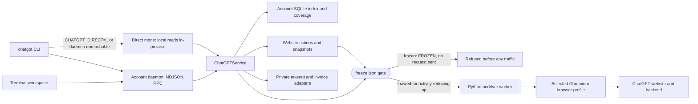

# From Jimmy to the ChatGPT website terminal

This describes the checked-in implementation and its limits. The evidence ledger is [CHATGPT-PLAN.md](CHATGPT-PLAN.md). An implemented operation is not automatically a verified feature on every account, and **a command documented here is never permission to run it** — the client drives a real signed-in account. Costs and permission rules for every site-bound command live in [the quickstart's cost index](CHATGPT-QUICKSTART.md).

## What Jimmy actually does

[bin/jimmy.ts](../bin/jimmy.ts) is a separate CLI for **chatjimmy.ai**, with `llama3.1-8B` as its default model. It sends JSON directly to `POST /api/chat`:

```json
{"messages":[{"role":"user","content":"Hello"}],"chatOptions":{"selectedModel":"llama3.1-8B"}}
```

The response is streamed plain text with trailing `<|stats|>…<|/stats|>` telemetry. Jimmy removes that telemetry from the answer and optionally reports it. Its optional Bun daemon maintains a warm connection with `/api/health` requests. The first call can go directly while the holder starts for later calls. Its terminal chat uses APIPlan's shared `src/chat.ts` UI. Global installation uses the platform shim helper.

Jimmy's source sends no account credential. It does not automate a browser, preserve website projects, enumerate a private account or speak an OpenAI-compatible completion protocol. The latency figures in its comments are historical measurements; the fixture numbers in `test/jimmy.test.ts` are not a current benchmark. The tests verify the request and response dialect against a local server.

The reusable design is **a small user command, shared interactive and scriptable operations, streaming output, and a persistent worker**. ChatGPT needs a different transport because its signed-in website state, controls and private account data are central to the requested workflow. Changing Jimmy's hostname would not supply those capabilities.

## ChatGPT execution path



### The freeze gate (2026-09-16)

`BrowserWorker` is the single choke point for everything that touches the site, so the stop switch
lives there. `start()` refuses to launch a browser while the account's `freeze.json` carries
`frozen:true`, and `call()` refuses every worker operation outside the activity-reducing set
(`status`, `close`, `surface.close`, `audio.output.stop`, `audio.clear`, `request.info`, `network`,
`snapshot`). Refusals throw `code:"FROZEN"`, `retryable:false`, message ending `no request was sent`.

The flag is a file, not process state, so it survives daemon shutdown, launchd respawn and reboot —
that is the property a `kill` cannot give. Clicking the website's own Stop control is still allowed
while frozen: `Actions.stop()` marks that one call with an in-process `Symbol`
(`ALLOW_WHILE_FROZEN`), and because a Symbol cannot be expressed in JSON, a daemon RPC payload, a
slash command or website text can never forge it. `service.ts` also makes `status` frozen-aware: while
frozen it skips the identity read, starts nothing, and reports `session:{skipped:"frozen"}`.

### Direct mode

`daemon.ts` `direct()` executes `DIRECT_READ_OPERATIONS` in-process — no daemon, no browser — when
`CHATGPT_DIRECT=1` is set, and automatically when the daemon is unreachable (for example a sandbox
that denies loopback TCP). The set is local reads plus the freeze switch itself, so an operator can
always stop traffic and inspect local state even with no daemon alive. Everything else fails with
`code:"DAEMON_REQUIRED"` and starts nothing. The direct service is built with `autoResume:false`, so a
local read never wakes the background archive writer.

`bin/chatgpt.ts` parses commands; `src/chatgpt/tui.ts` calls the same service operations. The account daemon uses authenticated loopback RPC and streams NDJSON events followed by one result or error receipt. Its private daemon record contains the local RPC token. This token is unrelated to the website login and should not be copied into diagnostic output.

The TypeScript transport starts the pinned nodriver Python worker and exchanges JSON lines. The worker maintains a dedicated interaction tab and a separate API tab in the selected browser session. Website requests retrieve the website session token inside that browser and call relative `/backend-api/` paths there. The session operation returns identity and authentication status, not the access token. This path does not read Codex credentials or use APIPlan's separate OpenAI provider credentials.

Structured reads enumerate data; browser actions submit messages and select the exact visible model/effort labels. Generation polls the website's messages, produces incremental text/media/progress events, and waits for the stop control to disappear with a stable response. A timeout is an unknown outcome: inspect the existing conversation before resubmitting.

## Accounts and browser ownership

Account records support `id`, `baseURL`, `browserPath`, `profilePath`, `cdpURL`, optional workspace identity and a source descriptor. Source providers include `managed`, `browser`, `accounttracker` and `apiplan`. The latter two are an integration contract for browser-session references; an automatic AccountTracker import or credential-conversion flow is not implemented by merely declaring those labels.

Managed profiles live under the selected account directory. An attached browser must expose a loopback Chromium debugging endpoint. Browser discovery covers configured Chrome/Chromium-family installation paths, including Arc on macOS. This is not universal automation of every installed browser: Firefox and Safari have no implemented adapter here.

The worker opens dedicated tabs instead of navigating the user's original tab. Stopping an attached worker does not terminate the daily browser. Headed/headless switching is supported for a managed browser and relaunches its profile; an attached browser rejects this operation. Changes to mode during generation are rejected.

Private state defaults to `~/.apiplan/chatgpt`, or `$CHATGPT_HOME`, with an account-specific directory beneath it. The SQLite index binds the observed user ID and rejects a different identity. Takeout directories use mode `0700`, raw files `0600`, account binding, a writer lock, SHA-256 hashes and resumable checkpoints. Unix permission semantics do not replace Windows filesystem ACL configuration.

## What coverage means

| Report | What it proves | What it does not prove |
| --- | --- | --- |
| Offset/cursor receipt | A particular enumeration terminated without known pagination gaps | Every possible website surface was enumerated |
| Conversation raw JSON | The returned mapping and all returned branches were preserved | Deleted, expired or server-omitted nodes were recovered |
| `conversations path` | One explicitly selected ancestor path | That this path includes every branch |
| Settings map | Visible settings tabs and controls were captured | All nested dialogs and conditional settings were explored |
| Capability catalog | Known feature names and their current implementation/evidence status | Full account-specific product parity |
| Takeout `integrity` | Every tracked file matches its manifest size/hash | The archive covers all remote data |
| Takeout `complete` | All reported scopes are complete and hashes match | Completeness when unresolved scopes remain |

`capabilities.ts` intentionally returns `complete:false`. Its catalog includes conversations, projects, GPTs, media, Health, Sites, Work, Apps, Library, Images, tools, settings, account, browser and reliability surfaces. Catalog inclusion records scope; it does not prove that a feature is available or has been operated. Entries labeled `implemented-unverified` have an operation path; `unmapped` entries retain a visible gap. Browser passthrough is a way to inspect and operate a surface, not evidence that every named feature works.

The September 15 ledger records an observed 1,054 active conversations across 11 pages, zero archived conversations, a project response and the account billing endpoint. These are a dated observation of the intended website profile. They must not be confused with the earlier separate credential that returned two conversations.

Takeout saves catalogs, complete returned conversation mappings, account/settings responses, project details and project conversation lists, GPT details, explicit media references and any successfully resolved media bytes. Inaccessible, partial and unsupported scopes remain separate. Unreconciled media counts, unobserved nested/archived media scopes, unexposed memories, GPT knowledge binaries and other server-only data currently prevent a claim that every remote account resource has been captured. Resume refreshes catalogs and account responses, reuses hash-verified conversation snapshots and refetches conversations whose reported update timestamp changed. Use a new output directory to retain a separate historical snapshot; concurrent account changes do not become an atomic server snapshot.

## Media, voice and browser boundaries

Uploads, screenshots, mouse/keyboard control, a terminal browser viewport and returned media metadata are implemented. An archive media resolver is injected through `downloadMedia(reference)` and must use an observed safe download mechanism. The verified image bootstrap reports active/archived counts and one thumbnail; its exact server-supplied signed `/backend-api/estuary/content` URL successfully returned WebP bytes. The media module downloads this opaque thumbnail reference and file IDs through the observed `/backend-api/files/download/{id}?inline=true` resolver, with MIME detection and filename extensions. It walks observed All-view, image-library and generated-image pagination, reconciles the generated/library image union with bootstrap, and retains explicit gaps for exposed folders or archived images without verified enumeration. See [CHATGPT-MEDIA-MAP.md](CHATGPT-MEDIA-MAP.md) for the evidence and scope. The archiver does not invent file-resolution endpoints or treat every prose URL as an asset.

The website's image, audio, video, camera, microphone, screen sharing, canvas and live voice surfaces are account- and browser-dependent. Their presence in the feature catalog is not a successful media round-trip test. A hidden browser also does not automatically provide a terminal microphone, speaker, camera or real-time audio bridge. Permissions and device routing require explicit implemented paths and verification. Use the browser viewport or headed browser for controls lacking a stable operation, and retain gaps in reports.

Invoice download uses the observed account transaction list and the Stripe invoice page's download control, with the resulting PDF header checked. `importInvoices` accepts only explicit downloaded paths. It stages copies through the existing invoices project's `import_upload` and commits through `import_confirm`, preserving its parser, filename convention, cross-process lock, invoice/tracking transaction and README index. Duplicate identity is provider plus invoice number. Originals remain intact. Only pre-commit HTTP-equivalent 412 conflicts are retried; ambiguous mutation failures are not blindly replayed.

## Events, failures and adapter updates

`dispatch` records operation start, completion or classified error with elapsed time in the private, rotated account event log. Generation and takeout have progress events. `--jsonl` renders event envelopes and a compact final result for agents. The daemon does not infer success from a stream that closes without a completion receipt.

Classifications include authentication required, site check required, rate limited, upstream unavailable, site drift, unknown outcome and account mismatch. A retryable transport label is not permission to replay a write. Read retries are bounded in takeout; an exhausted conversation-detail rate limit checkpoints and stops the run for later resume; generation is not automatically resubmitted.

Routes, selectors and visible labels live in a versioned adapter. `adapter.validate` validates shape and allowed backend paths and explicitly does **not** prove behavior. `adapter.promote` preserves the prior version in history and writes the current adapter atomically. Operations read the current adapter, so subsequent operations can use a revision without rebuilding the CLI. The `adapter.rollback` operation restores a known history revision by ID or version. Some actions still have explicit control predicates, so changing every selector in the adapter does not automatically rewrite all browser behavior.

## Command reference

Run from a checkout with `bun bin/chatgpt.ts …`; the global shim uses the same entry point. `--account ID` selects an isolated account, and `--jsonl` emits streaming events. Standard command results are JSON already. `--json` is accepted but does not define a different service protocol.

### Setup and accounts

`chatgpt setup`, `chatgpt doctor` and `chatgpt install` call the setup module directly. Setup uses `uv venv` and `uv pip install` with `nodriver==0.50.3` in a private environment. New environments default to Python 3.12; an existing environment is retained. Doctor checks the selected interpreter, pin, browser configuration and loopback endpoint without opening a tab or exposing secrets. Install reuses APIPlan's platform-specific shim, bin-directory and runtime conventions. Doctor does not verify website authentication; use `chatgpt status` for that.

```sh
chatgpt setup
chatgpt doctor
chatgpt install
chatgpt browsers
chatgpt accounts list
chatgpt accounts add personal --label Personal
chatgpt accounts add arc --cdp http://127.0.0.1:9223
chatgpt accounts use personal
chatgpt login
chatgpt status
chatgpt browser mode headed
chatgpt browser mode headless
chatgpt browser stop
chatgpt daemon stop
```

`login` opens a headed managed browser or attaches the configured browser. The user completes website login in that browser. `browser stop` closes the worker; another service operation can start it again. `daemon stop` shuts down the account daemon.

### Conversations, projects and catalogs

```sh
chatgpt conversations list --all
chatgpt conversations list --archived
chatgpt conversations get CONVERSATION_ID
chatgpt conversations search "search text"
chatgpt conversations path CONVERSATION_ID --node NODE_ID
chatgpt conversations export CONVERSATION_ID --output /absolute/chat.json
chatgpt conversations open CONVERSATION_ID
chatgpt projects list
chatgpt projects get PROJECT_ID
chatgpt projects chats PROJECT_ID
chatgpt gpts list
chatgpt gpts get GPT_ID
chatgpt models list
chatgpt voices list
```

`--all` includes both active and archived conversation catalogs. Search reads the local index; fetch conversations or take out an account before expecting full message search coverage. `--maxPages N` and `--pageSize N` bound applicable enumeration; examine its receipt when setting limits.

```sh
chatgpt chat new --text "Hello" --jsonl
chatgpt chat send --conversation CONVERSATION_ID --text "Continue" --jsonl
chatgpt chat new --project PROJECT_ID --text "Work in this project"
chatgpt chat new --gpt GPT_ID --text "Use this GPT"
chatgpt chat model --model "EXACT WEBSITE LABEL"
chatgpt chat effort --effort "EXACT WEBSITE LABEL"
chatgpt chat stop
```

### Settings, account data and coverage

```sh
chatgpt settings get
chatgpt settings instructions
chatgpt settings open --section General
chatgpt settings map --jsonl
chatgpt account get
chatgpt features list
chatgpt tasks list
chatgpt plugins list
chatgpt connectors list
chatgpt pins list
chatgpt capabilities list
chatgpt invoices list
chatgpt invoices download INVOICE_ID
chatgpt invoices sync --jsonl
chatgpt takeout --output /absolute/private-archive --jsonl
chatgpt takeout audit --archive /absolute/private-archive
chatgpt media list
chatgpt media export --catalog /absolute/private-catalog.json --output /absolute/media-export --jsonl
chatgpt media audit --output /absolute/media-export
```

Some backend reads may return inaccessible or changed responses for a particular account. Invoice import is also available programmatically as `importInvoices(['/absolute/invoice.pdf'], {projectPath:'/absolute/invoices'})`. `invoices sync` downloads each listed invoice, imports it through the existing invoice project, and checkpoints invoice IDs and hashes.

> 🛑 **Two commands in that block are bulk or irreversible.** `chatgpt takeout` (no subcommand) is the
> full crawl — up to 1,063 conversation-detail reads paced 5 s apart. `chatgpt takeout --original`
> clicks Export data and then Confirm export in his real settings, submitting OpenAI's official account
> export; he receives an email and it cannot be recalled. Inspection was verified with cancellation
> (`originalExport(false)`), and no live export request has been submitted. Both need the account
> owner's word in the current conversation; `takeout status`, `takeout audit` and
> `takeout watch-status` read local disk and are the safe alternatives.

### Browser controls and maintenance

```sh
chatgpt ui snapshot
chatgpt ui click --ref 17 --epoch SNAPSHOT_EPOCH
chatgpt ui fill --ref 18 --epoch SNAPSHOT_EPOCH --text "value"
chatgpt ui key --key Enter
chatgpt ui text --text "literal input"
chatgpt ui mouse --x 300 --y 400
chatgpt ui scroll --dy 600
chatgpt ui upload /absolute/attachment.pdf
chatgpt ui viewport --width 1400 --height 950
chatgpt ui screenshot --output /absolute/screen.png
chatgpt browser open --url https://chatgpt.com/
chatgpt map network
chatgpt api request --path /backend-api/models
chatgpt adapter get
chatgpt adapter validate --path /absolute/adapter.json
chatgpt adapter promote --path /absolute/adapter.json
chatgpt monitor events --limit 100
```

Take a fresh snapshot after navigation or changed UI. References are tied to a snapshot epoch and stale references are rejected.

> 🛑 **`api request` has the largest blast radius in this client.** It issues any HTTP method against
> any `/backend-api/` path with any JSON body, authenticated with his live bearer token. The only
> checks are the path prefix and the absence of a host; there is no method allowlist and no
> confirmation. Capabilities this project calls "unimplemented" — conversation delete among them —
> are one `--method` away, and that would destroy his data rather than reveal a missing feature.
> Treat it as a read-only escape hatch: `--method GET`, no `--body`, only on an already-observed
> route. Any other method needs his explicit word for that exact path and body. The `ui` primitives
> carry the same hazard on the UI side: they click and type into a live, signed-in page. Never infer
> that an arbitrary write is safe to retry.

### Terminal workspace

A bare `chatgpt` starts the terminal workspace. `chatgpt tui --mock` runs its offline fixture. Tab cycles panes; Ctrl+K opens commands; Ctrl+F searches navigation; Ctrl+N starts a conversation; Ctrl+B opens the browser inspector; Ctrl+J inserts a newline; Enter submits or activates; Ctrl+C stops a response or closes an overlay; Ctrl+Q quits. Page Up/Down scroll history. The command palette exposes account selection, browser viewport, models, exact-label effort, upload, screenshots, settings map and capability inspection.

The viewport forwards keyboard and mouse input to the selected browser. Escape returns to the workspace. It is a browser display/control layer, not an independently verified audio/video device transport.

Standalone media exports can be reused by takeout through `readExportedMedia`: account identity, byte count and SHA-256 must match before reuse. The default cache is the selected account’s `media-export` directory; `--mediaExport /absolute/cache` selects another. Corrupt or mismatched files fall back to the downloader. Captured HTML/JSON documents are preserved only when the owned catalog explicitly supplies the matching MIME type.

## Capability export schema 3

Capability evidence distinguishes `operation-completed`, `observed-partial`, `historical-operation`, `implemented-unverified` and `unmapped`. A dispatch that returns without throwing can still represent an unconfirmed action or incomplete catalog; it is never sufficient evidence of full feature parity. Evidence must identify the operation and current adapter revision to count as current. Every capability retains `parityVerified:false`; browser access is not an end-to-end feature verification.

The settings export recursively includes `nested[].controls`, with stable IDs containing the trigger path and `requiresFreshReference:true`. It separately preserves unvisited controls, navigation coverage and nested discovery evidence. Opening a menu without selection is discovery, not a verified settings change. Navigation completeness does not close conditional/nested settings gaps.

`gpts.list` and `gpts.owned` now enumerate the observed My GPTs route with full cursor pagination; the current account returned zero owned GPTs with a complete scope receipt. `gpts.bootstrap` preserves bootstrap gizmos as a separate scope, and `gpts.catalog` exposes public/recent/trending discovery. An empty bootstrap response alone never proves an empty owned collection. Likewise, a local `takeout.run` receipt does not verify the `--original` official export request. Health, Sites and Work remain explicit capability families, with implementation and evidence assessed per action. Audio/video metadata and generic browser controls do not imply working live device transport.

Automatic runtime gating reloads candidate code before operations and preserves the last good runtime when validation fails. This is separate from semantic adapter verification. Binary transport uses 262,144-byte browser chunks to a private transfer file, followed by service-side size/hash validation. A 228,757,004-byte asset (approximately 229 MB) passed live transfer and hash verification. This proves the large-file transport path, not completion of all archive assets.

For the current command inventory, the stop control and the per-command cost index, use [CHATGPT-QUICKSTART.md](CHATGPT-QUICKSTART.md). Explicit audio input/play/status/clear operations feed a local fixture into the website’s microphone stream; they do not establish end-to-end transcription. `dictation transcribe` remains under diagnosis. Rename, pin/unpin and archive/unarchive were verified and restored on the dedicated integration chat. OS-login autostart is implemented as a macOS module; installation has not been established by these receipts.
